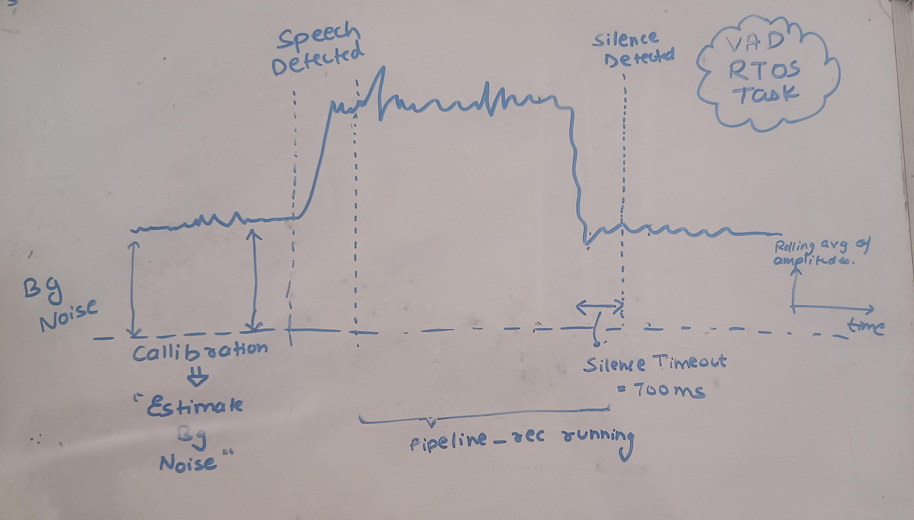

# 🧠 SoftIQ — A Smart ESP32-Powered Voice Assistant
SoftIQ is a compact, ESP32-LyraT-powered voice assistant that listens, chats with an AI, and talks back — all over Wi-Fi. Whether you're pressing a button to speak or talking naturally using voice detection, SoftIQ keeps the experience smooth, responsive, and intelligent.

---

## 🔧 System Overview

SoftIQ runs **two audio pipelines** on the ESP:

- 🎙️ **Rec Pipeline** – Captures and sends your voice.
- 🔊 **Play Pipeline** – Plays the AI-generated response through speakers.

These pipelines are carefully linked and managed via Wi-Fi to ensure real-time, low-latency interaction.

### 📊 Architecture

.svg)

---

## 📶 Wi-Fi Provisioning (Smart Config)

Before it can talk, SoftIQ needs to get online — and we’ve made that easy using **Smart Config**.

### How it works:
1. ESP boots in **station mode** and waits.
2. You connect your **phone to ESP** and send Wi-Fi credentials.
3. ESP receives your **SSID and password**.
4. It connects to the actual network and is ready to roll!

### 📶 Provisioning Flow

---

## 🌐 Server Communication

SoftIQ connects to a FastAPI server and uses three key routes:

### 1. `/upload` – 🎧 Send Audio
- ESP uploads `.wav` audio.
- Server runs:
  - Google STT (Speech-to-Text)
  - Chat Completion (OpenAI API)
  - Sets `newResponse = 1` when ready

### 2. `/status` – 📡 Poll for New Response
- ESP keeps polling this endpoint.
- When `newResponse == 1`, it plays back the response.

### 3. `/stream` – 🔊 Get Response
- ESP fetches MP3 audio using Eleven Labs TTS.
- Audio is streamed and played through connected speakers.

---

## 🗣️ Interaction Modes

SoftIQ supports two main modes of communication:

---

### 🔘 1. Button-Hold Flow (Manual)

This is the most reliable and responsive mode.

**Flow:**
1. Hold down the **REC button** to talk.
2. Audio is recorded while the button is pressed.
3. On release:
   - Recording stops,
   - Audio is sent to the server,
   - ESP polls for response and plays it back.

✅ **Pros:**
- Low latency  
- High accuracy  
- Controlled experience

📊 State Flow:

.svg)

---

### 🗣️ 2. VAD State Flow (Hands-Free)

This uses **Voice Activity Detection** to talk without pressing anything.

**How it works:**
1. ESP **calibrates background noise** first.
2. It uses the **rolling average of audio amplitude** to detect spikes.
3. When you speak:
   - Recording starts on the spike,
   - Stops after **700ms of silence**.
4. Sends to server, then plays response.
5. After **30s of playback**, VAD resets.

📊 State Flow:

---

### ⚙️ VAD is an RTOS Task!

The entire VAD system runs as a **separate FreeRTOS task**, so it works in parallel with the main loop. This allows continuous background monitoring for voice input without blocking other operations.

### 💡 LED Indicators in VAD Flow:

- When VAD **starts recording**, it **blinks LED 1**.
- After playback, when VAD **restarts listening**, it **blinks LED 2**.

---

## 💬 Built With

- **ESP32-LyraT Mini V1.2** + ESP-ADF  
- **FastAPI** backend  
- **OpenAI STT** + **OpenAI GPT**  
- **Eleven Labs TTS**  
- **Smart Config** for Wi-Fi provisioning  
- **FreeRTOS** for task management
---

